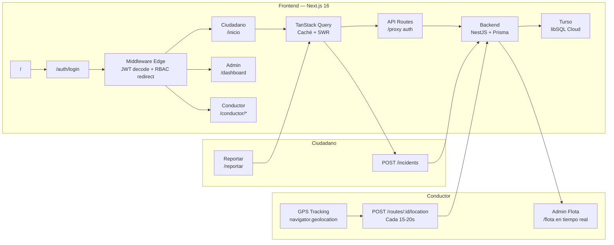
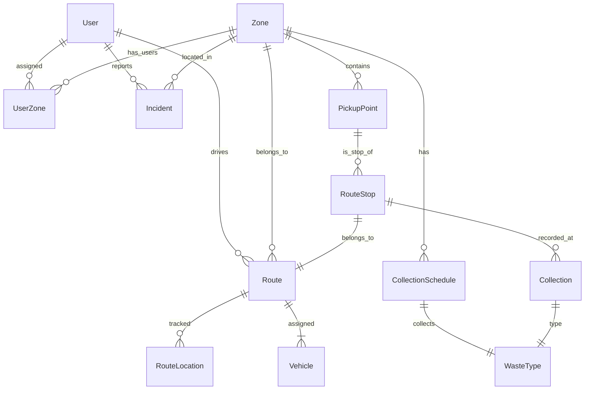

# Eco Track Cusco — UNSAAC

Sistema de monitoreo de recolección de residuos sólidos para el distrito de Wanchaq, Cusco. Desarrollado como proyecto de la UNSAAC en colaboración con la Municipalidad Distrital de Wanchaq.

**Frontend:** Next.js 16 · App Router · React 19 · Tailwind CSS v4 · TanStack Query · PWA \
**Backend:** NestJS 11 · TypeScript · Prisma · Turso (libSQL) · Swagger · Helmet · Throttler \
**Auth:** JWT + Passport · middleware edge · guards por rol · httpOnly cookies · rate limiting \
**Mapa:** MapLibre GL · OSRM (cálculo de rutas) · Nominatim (geocoding) · dark mode adaptativo \
**DB:** Turso (libSQL cloud) — exclusivo, sin SQLite local

---

## Arquitectura

### Flujo de datos



### Modelo de datos



---

## Desarrollo

```bash
# Frontend (raíz del proyecto)
npm run dev
# http://localhost:3000

# Backend (directorio backend/)
cd backend && npm run start:dev
# http://localhost:3001

# Reparar FKs en Turso (solo si hay migración rota)
cd backend && npx ts-node prisma/recover-db.ts

# Seed (recrea datos de prueba — requiere Turso activo)
cd backend && npm run prisma:seed

# Documentación Swagger
# http://localhost:3001/docs
```

---

## Deploy

### Frontend → [Vercel](https://vercel.com)

| Variable | Valor |
|----------|-------|
| `NEXT_PUBLIC_API_URL` | `https://tu-backend.onrender.com` |

### Backend → [Render](https://render.com)

| Campo | Valor |
|-------|-------|
| Root Directory | `backend` |
| Build Command | `npm install && npm run build` |
| Start Command | `npm run start:prod` |
| Port | `3001` |

**Variables de entorno:**

| Variable | Descripción |
|----------|-------------|
| `TURSO_DATABASE_URL` | `libsql://...` (obligatorio) |
| `TURSO_AUTH_TOKEN` | Token de autenticación Turso |
| `JWT_SECRET` | Secreto JWT — usar `openssl rand -base64 32` |
| `JWT_EXPIRATION` | `7d` |
| `CORS_ORIGINS` | Orígenes CORS separados por coma |

### Troubleshooting

| Problema | Solución |
|----------|----------|
| Backend crashea con "JWT_SECRET is required" | Configurar variable en Render → Environment |
| Frontend en blanco | Verificar `NEXT_PUBLIC_API_URL` en Vercel, redeploy |
| 401 en todos los requests | `JWT_SECRET` regenerado — usuarios deben reloguear |
| 429 Too Many Requests en login | Esperar 60s, o ajustar límites en `app.module.ts` |
| `no such table: main.routes_old` | Ejecutar `npx ts-node prisma/recover-db.ts` desde `backend/` |

---

## Estado del proyecto

### Backend — API REST (+30 endpoints)

| Módulo | Endpoints | Status |
|--------|-----------|--------|
| `Auth` | `POST /auth/register`, `POST /auth/login`, `GET /auth/me`, `PATCH /auth/me` | ✅ |
| `Users` | CRUD + stats + zone assignment | ✅ |
| `Zones` | CRUD (GET público, resto ADMIN) | ✅ |
| `PickupPoints` | CRUD con filtro `?zoneId=` | ✅ |
| `Schedules` | CRUD con filtros `?zoneId=&wasteTypeId=` | ✅ |
| `Incidents` | `POST /incidents`, `GET /incidents/my`, CRUD admin | ✅ |
| `Routes` | CRUD + fleet + start/complete + stops + locations | ✅ |
| `WasteType` | CRUD (GET público, ADMIN write) | ✅ |
| `Vehicles` | CRUD (ADMIN) | ✅ |
| `Collections` | `POST /collections` (conductor) | ✅ |
| `Admin` | `GET /admin/dashboard`, `GET /admin/analytics` | ✅ |

### Frontend — Páginas

| Página | Ruta | Rol |
|--------|------|-----|
| Onboarding / Registro | `/` | Público |
| Login | `/auth/login` | Público |
| Inicio ciudadano | `/inicio` | CITIZEN |
| Horarios de recolección | `/recoleccion` | CITIZEN |
| Puntos de recojo | `/puntos-recojo` | CITIZEN |
| Reportar incidencia | `/reportar` | CITIZEN |
| Mis incidencias | `/incidencias` | CITIZEN |
| Mapa | `/mapa` | CITIZEN |
| Perfil | `/perfil` | Todos |
| Dashboard admin | `/dashboard` | ADMIN |
| Flota en tiempo real | `/flota` | ADMIN |
| Gestión de usuarios | `/usuarios` | ADMIN |
| Incidencias admin | `/admin-incidencias` | ADMIN |
| Gestión de rutas | `/admin-rutas` | ADMIN |
| Analíticas | `/analisis` | ADMIN |
| Configuración | `/configuracion` | ADMIN |
| Panel conductor | `/conductor/dashboard` | DRIVER |
| Mapa de ruta | `/conductor/mapa` | DRIVER |
| Paradas y recolección | `/conductor/ruta` | DRIVER |

### Características implementadas

| Característica | Detalle |
|----------------|---------|
| Rutas del rutero oficial | 287 paradas · 19 rutas · Wanchaq 2024 |
| CRUD de rutas con mapa | Crear y editar paradas directamente en MapLibre |
| Edición de rutas | Nombre, turno, frecuencia, conductor y paradas en un modal |
| GPS tracking | Conductor envía posición cada 15s, admin la ve en tiempo real |
| Credenciales en login | Panel de cuentas de prueba con autocompletado |
| Configuración admin | CRUD de tipos de residuos, vehículos, parámetros del sistema |
| Turso exclusivo | Sin SQLite local — todo va a Turso cloud |
| recover-db | Script que repara FKs rotas con `@libsql/client` batch() |
| TanStack Query | Caché y stale-while-revalidate en todo el frontend |
| PWA | Manifest + service worker para instalación en móvil |
| Dark mode en mapa | MapLibre cambia a dark-matter-gl-style automáticamente |
| JWT httpOnly | Login/register via API route proxy |
| Helmet + Throttler | Headers de seguridad + rate limiting |
| Tests backend | 89 tests unitarios + 9 e2e |
| CI/CD | GitHub Actions en push/PR |

---

## Datos de prueba

```bash
cd backend && npm run prisma:seed
```

> ⚠️ Solo para demo. En producción, rotar todas las contraseñas.

| Email | Contraseña | Rol |
|-------|-----------|-----|
| admin@ecotrack.pe | 123456 | Administrador |
| carlos.conductor@ecotrack.pe | 123456 | Conductor |
| maria.conductora@ecotrack.pe | 123456 | Conductor |
| juan@ecotrack.pe | 123456 | Ciudadano |
| rosa@ecotrack.pe | 123456 | Ciudadano |
| pedro@ecotrack.pe | 123456 | Ciudadano |
| lucia@ecotrack.pe | 123456 | Ciudadano |
| miguel@ecotrack.pe | 123456 | Ciudadano |

---

## Estructura del proyecto

```
app/
├── middleware.ts            ← Edge auth (JWT decode + redirect por rol)
├── providers.tsx            ← Auth + Query + Toast + OfflineBanner
├── api/auth/                ← Proxy login/register/logout → httpOnly cookie
├── auth/                    ← Login + Register
├── (citizen)/               ← Layout con bottom tabs
│   ├── inicio/
│   ├── recoleccion/
│   ├── puntos-recojo/
│   ├── reportar/
│   ├── incidencias/
│   ├── mapa/
│   └── perfil/
└── (admin)/                 ← Layout con sidebar
    ├── dashboard/
    ├── flota/
    ├── usuarios/
    ├── admin-incidencias/
    ├── admin-rutas/         ← Crear + editar rutas en mapa interactivo
    ├── analisis/
    └── configuracion/       ← Tipos de residuos + vehículos + parámetros

conductor/
├── dashboard/
├── mapa/                    ← MapLibre + OSRM
└── ruta/                    ← Paradas + recolección

lib/
├── api.ts                   ← HTTP client con JWT interceptor
├── auth-context.tsx
├── queries.ts               ← TanStack Query factory
├── types.ts
├── waste-colors.ts
└── status.ts

components/
├── ui/                      ← Button, Badge, Spinner, Card, Input, Avatar, Toast, Skeleton…
├── map-view.tsx             ← MapLibre GL con dark mode y marcadores adaptativos
└── …

backend/
├── src/
│   ├── auth/
│   ├── users/
│   ├── zones/
│   ├── pickup-points/
│   ├── collection-schedules/
│   ├── incidents/
│   ├── routes/              ← CRUD + fleet + GPS locations
│   ├── vehicles/
│   ├── waste-types/
│   ├── admin/
│   ├── prisma/              ← PrismaService Turso-only
│   └── common/              ← Guards, decorators, filters
└── prisma/
    ├── schema.prisma        ← 12 modelos
    ├── seed.ts              ← 287 paradas · 19 rutas del rutero oficial
    ├── migrate-turso.ts     ← ALTER TABLE ADD COLUMN incremental
    └── recover-db.ts        ← Reparación de FKs con batch() de libSQL
```

---

## Design System

Paleta verde tierra inspirada en los Andes · Nunito Sans · Material Symbols · esquinas redondeadas

| Token | Color | Uso |
|-------|-------|-----|
| `primary` | #154212 | Acciones principales, headers |
| `secondary` | #805533 | Elementos secundarios |
| `waste-organic` | #4CAF50 | Residuos orgánicos |
| `waste-recyclable` | #2196F3 | Reciclables |
| `waste-non-recyclable` | #757575 | No reciclables |
| `status-alert` | #E76F51 | Alertas y estados críticos |

---

## Pendiente para producción

| Aspecto | Estado |
|---------|--------|
| Refresh token | ❌ Solo JWT de 7 días |
| Logging estructurado | ❌ Sin Pino/Winston |
| Monitorización de errores | ❌ Sin Sentry |
