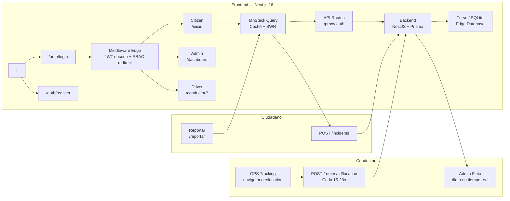
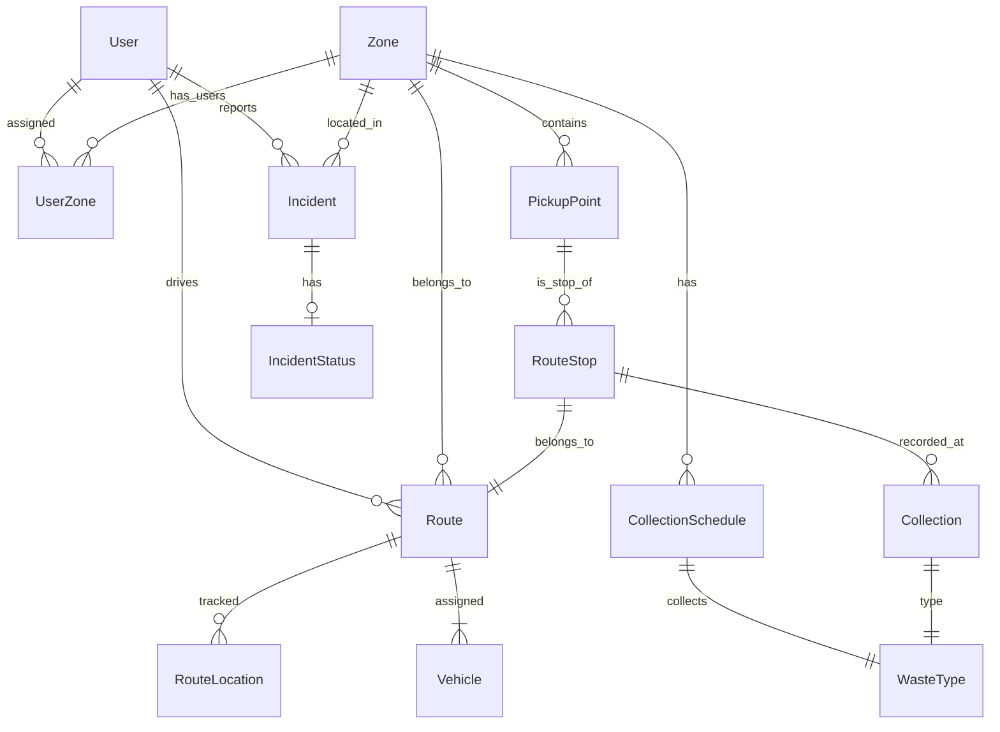
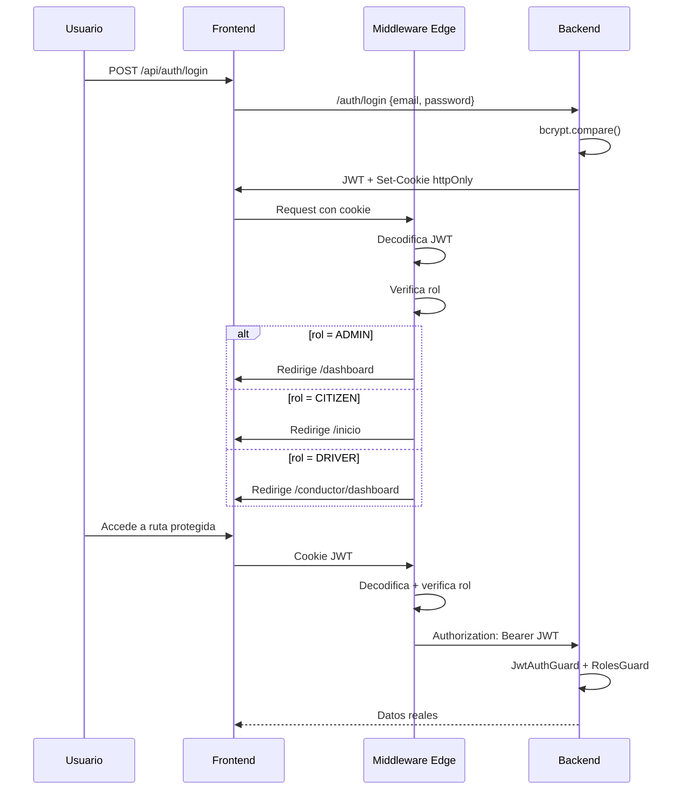
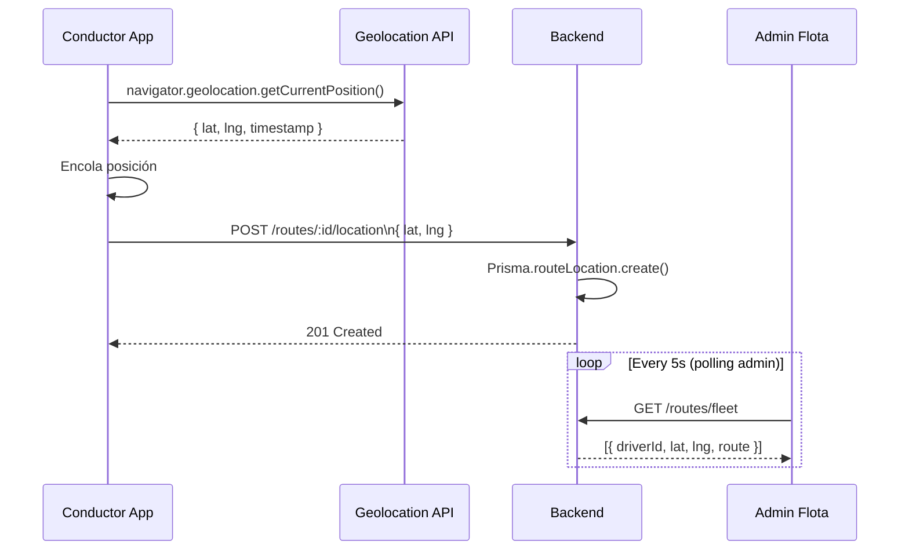
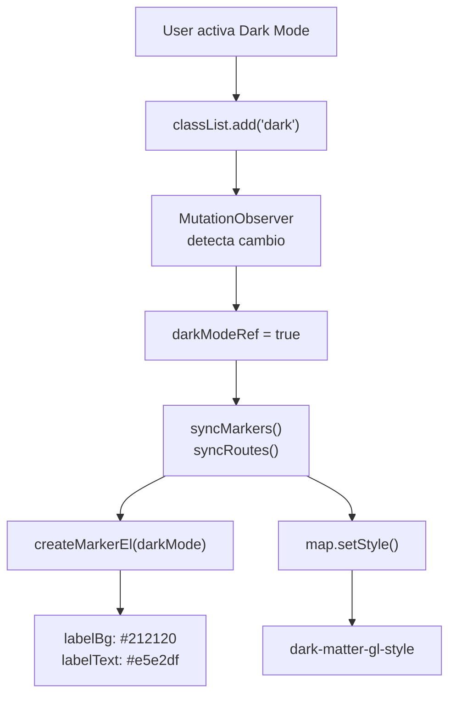

# Eco Track Cusco — UNSAAC

Sistema inteligente de recolección de residuos para Cusco, con monitoreo en tiempo real y participación ciudadana.

**Frontend:** Next.js 16 · App Router · React 19 · Tailwind CSS v4 · TanStack Query · PWA \
**Backend:** NestJS 11 · TypeScript · Prisma · SQLite / Turso (libSQL) · Swagger · Helmet · Throttler \
**Auth:** JWT con Passport (backend) + middleware edge + guards por rol + httpOnly cookies + rate limiting \
**Tracking:** GPS en tiempo real con geolocation API + polling en mapa admin

---

## Arquitectura

### Flujo de datos



### Modelo de datos



### Autenticación y autorización



### GPS Tracking — Conductor



### Dark mode — Mapa adaptativo



---

## Desarrollo

```bash
# Frontend (raíz del proyecto)
npm run dev
# http://localhost:3000

# Backend (directorio backend/)
cd backend && npm run start:dev
# http://localhost:3001

# Seed (recrea datos de prueba)
cd backend && npm run prisma:seed

# Documentación Swagger
# http://localhost:3001/docs
```

---

## Deploy

### Frontend → [Vercel](https://vercel.com)

Conectar repo desde dashboard de Vercel. Framework se auto-detecta como Next.js.

| Variable | Valor |
|----------|-------|
| `NEXT_PUBLIC_API_URL` | `https://tu-backend.onrender.com` |
| Build Command | `npm run build` |
| Output | `.next` |

### Backend → [Render](https://render.com)

Web Service desde dashboard de Render:

| Campo | Valor |
|-------|-------|
| Root Directory | `backend` |
| Build Command | `npm install && npm run build` |
| Start Command | `npm run start:prod` |
| Port | `3001` |

**Variables de entorno:**

| Variable | Descripción |
|----------|-------------|
| `TURSO_DATABASE_URL` | `libsql://...` (obligatorio en Render) |
| `TURSO_AUTH_TOKEN` | Token de Turso |
| `JWT_SECRET` | Secreto para firmar JWT. En producción, usar una cadena fuerte aleatoria: `openssl rand -base64 32` |
| `JWT_EXPIRATION` | `7d` |
| `CORS_ORIGINS` | Orígenes permitidos para CORS, separados por coma. Ej: `https://tu-frontend.vercel.app` |

> ⚠️ **Importante:** Con Turso, el schema y los datos persisten independientemente del deploy.
> Para seed inicial de Turso: `cd backend && npm run start:prod:seed` una sola vez.
> Para frontend en Vercel: `NEXT_PUBLIC_API_URL` debe ser la URL del backend en Render.

### Troubleshooting

| Problema | Causa probable | Solución |
|----------|----------------|----------|
| Backend crashea al startup con "JWT_SECRET is required" | Variable no configurada en Render | Configurar `JWT_SECRET` en Environment → Add Environment Variable |
| Render deploy falla con "Cannot find module" | Build artifacts no encontrados | Verificar que `start:prod` apunta a `dist/src/main` |
| Frontend muestra pantalla en blanco | `NEXT_PUBLIC_API_URL` no configurada o mal | Verificar variable en Vercel dashboard, redeploy |
| 401 en todos los requests | `JWT_SECRET` fue regenerado por Render | Los usuarios deben volver a iniciar sesión (esperado al primer deploy) |
| 429 Too Many Requests en /auth/login | Rate limiting activo | Esperar 60 segundos, o ajustar límites en `app.module.ts` |
| Tests e2e fallan con "JWT_SECRET is required" | Variable no seteada en CI/CD | Configurar `JWT_SECRET` como secret en GitHub Actions (ya se hace en workflow) |

---

## Estado del proyecto — MVP

### Backend — API REST (+30 endpoints)

| Módulo | Endpoints | Status |
|--------|-----------|--------|
| `Auth` | `POST /auth/register`, `POST /auth/login`, `GET /auth/me`, `PATCH /auth/me` | ✅ |
| `Users` | CRUD + `GET /users/me`, `GET /users/stats`, `PATCH /users/:id/zones` | ✅ |
| `Zones` | CRUD (GET público, resto ADMIN) | ✅ |
| `PickupPoints` | CRUD con filtro `?zoneId=` (GET público, resto ADMIN) | ✅ |
| `Schedules` | CRUD con filtros `?zoneId=&wasteTypeId=` (GET público, resto ADMIN) | ✅ |
| `Incidents` | `POST /incidents`, `GET /incidents/my`, CRUD admin con filtro `?status=` | ✅ |
| `Routes` | CRUD + `GET /routes/fleet`, `GET /routes/my`, `GET /routes/zone/:zoneId` | ✅ |
| `Admin` | `GET /admin/dashboard`, `GET /admin/analytics` | ✅ |
| `WasteType` | CRUD (GET público, ADMIN create/update/delete) | ✅ |
| `Collections` | `POST /collections` (conductor) | ✅ |

### Frontend — Páginas conectadas a API real

| Página | Ruta | Status |
|--------|------|--------|
| Onboarding / Registro | `/` | ✅ |
| Login | `/auth/login` | ✅ |
| Perfil | `/perfil` | ✅ |
| Inicio ciudadano | `/inicio` | ✅ |
| Mapa | `/mapa` | ✅ |
| Horarios | `/recoleccion` | ✅ |
| Puntos de recojo | `/puntos-recojo` | ✅ |
| Reportar incidencia | `/reportar` | ✅ |
| Mis incidencias | `/incidencias` | ✅ |
| Dashboard admin | `/dashboard` | ✅ |
| Flota | `/flota` | ✅ |
| Usuarios | `/usuarios` | ✅ |
| Incidencias admin | `/admin-incidencias` | ✅ |
| Analíticas | `/analisis` | ✅ |
| Gestión rutas | `/admin-rutas` | ✅ |
| Panel conductor | `/conductor/*` | ✅ |
| Configuración | `/configuracion` | 🔜 |
| Catálogo residuos | `/residuos` | ✅ |
| Registro ciudadano | `/auth/register` | ✅ |
| Zonas (admin) | `/admin-zonas` | ✅ |
| Tracking GPS conductor | `/conductor/ruta` | ✅ Envío cada 15s/20m |
| Mapa en vivo | `/flota` | ✅ Posiciones de conductores en tiempo real |

### Mejoras arquitectónicas implementadas

| Mejora | Status |
|--------|--------|
| TanStack Query — fetching con caché y stale-while-revalidate | ✅ |
| Swagger / OpenAPI — documentación interactiva en `/docs` | ✅ |
| Paginación en listas críticas (`incidents`, `schedules`, `users`) | ✅ |
| Fechas como `DateTime` nativo de Prisma (antes `String`) | ✅ |
| Soft-delete consistente en todos los módulos | ✅ |
| `CurrentUser` decorator con tipado fuerte y validación | ✅ |
| `PrismaService` sin `require()` dinámico | ✅ |
| PWA — manifest + service worker para instalación en celular | ✅ |
| Tracking GPS — conductor envía posición cada 15s/20m | ✅ |
| Mapa en vivo — admin ve posiciones en tiempo real en `/flota` | ✅ |
| JWT httpOnly cookie — login/register via API route proxy | ✅ |
| Página `/auth/register` dedicada | ✅ |
| CRUD zonas admin (`/admin-zonas`) | ✅ |
| Helmet — headers de seguridad HTTP | ✅ |
| Rate limiting (@nestjs/throttler) — login 10/min, register 5/min | ✅ |
| Validación runtime de JWT_SECRET — fail-fast en startup | ✅ |
| Validación de NEXT_PUBLIC_API_URL — fail-fast en build | ✅ |
| GitHub Actions CI — lint + typecheck + tests on push/PR | ✅ |
| Try-catch en fetch (frontend) — ApiClientError(0) en network errors | ✅ |
| Try-catch en Prisma $connect (backend) — error claro si Turso falla | ✅ |
| Compound index en RouteLocation(routeId, recordedAt) | ✅ |
| Tests unitarios backend — 89 tests, 9 archivos | ✅ |
| Tests e2e backend — 9 tests (auth, incidents, collections, admin) | ✅ |

### Seguridad

| Capa | Status |
|------|--------|
| JWT con Passport (backend) | ✅ Global JwtAuthGuard + RolesGuard |
| Middleware edge Next.js (frontend) | ✅ Decodifica JWT + redirige por rol |
| Client-side guards | ✅ AdminShell, CitizenGuard, DriverGuard verifican rol |
| **RBAC** | ✅ Triple capa: middleware → guards → redirect post-login |

---

## UI Components

Documentación interactiva en `/components`

### Imports

```tsx
// Componentes
import { Button, Badge, Spinner, Card, Input, Avatar } from '@/components/ui';
import { ErrorBoundary, RetryError, OfflineBanner } from '@/components/ui';
import { Skeleton, SkeletonText, SkeletonCard, SkeletonList } from '@/components/ui';

// Hooks
import { useToast } from '@/hooks/use-toast';
import { useOfflineStatus } from '@/hooks/use-offline-status';

// Tokens
import { WASTE_CATEGORY_COLORS, WASTE_CATEGORY_LABELS } from '@/lib/waste-colors';
import { STATUS_CONFIG, INCIDENT_TYPE_LABELS } from '@/lib/status';
```

### Componentes (`components/ui/`)

| Componente | Props | Descripción |
|-----------|-------|-------------|
| `Button` | `variant`, `size`, `loading`, `icon`, `iconRight`, `disabled` | 4 variantes, 3 tamaños |
| `Badge` | `variant`, `color`, `children` | Auto-detecta status/role/waste |
| `Spinner` | `size` | sm/md/lg |
| `Card` | `padding`, `accent`, `className` | 4 tamaños, acentos con borde |
| `Input` | `label`, `error`, `helper`, `disabled` | Estados normal/error/disabled |
| `Avatar` | `name`, `src`, `size` | Initiales automáticas, fallback imagen |
| `Skeleton` | `className` | Bloque base para estados de carga |
| `SkeletonText` | `lines`, `className` | Líneas de texto animado |
| `SkeletonCard` | `className` | Tarjeta simulada completa |
| `SkeletonList` | `count` | Lista deSkeletonCards |
| `ErrorBoundary` | `fallback`, `onError` | Captura errores de React |
| `RetryError` | `title`, `message`, `onRetry` | UI de error con retry async |
| `OfflineBanner` | — | Fijo bottom cuando offline |

### Hooks (`hooks/`)

| Hook | Retorna | Descripción |
|------|---------|-------------|
| `useToast()` | `{ addToast, removeToast }` | Notificaciones 4 tipos |
| `useOfflineStatus()` | `boolean` | `true` cuando offline |

### Tokens (`lib/`)

| Módulo | Exports | Uso |
|--------|---------|-----|
| `waste-colors.ts` | `WASTE_CATEGORY_COLORS`, `WASTE_CATEGORY_LABELS` | Colores para orgánicos, reciclables, etc |
| `status.ts` | `STATUS_CONFIG`, `INCIDENT_TYPE_LABELS` | Labels para estados y tipos de incidente |

### Uso rápido

```tsx
// Toast
const { addToast } = useToast();
addToast('success', 'Registro guardado');
addToast('error', 'Error al procesar', 6000);

// Offline status
const isOffline = useOfflineStatus();

// Skeleton loading
<SkeletonList count={5} />
<SkeletonCard />

// Error boundary
<ErrorBoundary fallback={<MyCustomError />}>
  <MyFlakyComponent />
</ErrorBoundary>

// RetryError component
<RetryError
  title="Error al cargar"
  message="No pudimos obtener los datos"
  onRetry={fetchData}
/>
```

---

## Lo que falta del MVP

### Backlog pendiente

| ID | Tarea | Prioridad | Estado |
|----|-------|-----------|--------|
| BE-57 | `GET/POST /waste-types/:id/classify` — clasificar residuo específico | Baja | 🔜 |
| FE-54 | `StatusBadge` — componente reutilizable de badges | Baja | 🔜 |

### Crítico para producción

| Aspecto | Estado |
|---------|--------|
| Refresh token | ❌ Solo JWT único de 7 días |
| Logging estructurado | ❌ Sin Pino/Winston |
| Monitorización | ❌ Sin Sentry o similar |

---

## Screens actuales

| Ruta | Vista | Auth |
|------|-------|------|
| `/` | Onboarding / Registro ciudadano | Público |
| `/auth/login` | Inicio de sesión | Público |
| `/inicio` | Inicio ciudadano | Requiere login |
| `/recoleccion` | Horarios de recolección por zona | Requiere login |
| `/puntos-recojo` | Puntos de recojo cercanos | Requiere login |
| `/reportar` | Reportar incidencia | Requiere login |
| `/incidencias` | Mis incidencias reportadas | Requiere login |
| `/mapa` | Mapa de recolección | Requiere login |
| `/perfil` | Perfil del usuario | Requiere login |
| `/dashboard` | Panel de administración | Requiere ADMIN |
| `/flota` | Monitoreo de flota con mapa interactivo | Requiere ADMIN |
| `/usuarios` | Gestión de usuarios | Requiere ADMIN |
| `/admin-incidencias` | Gestión de incidencias | Requiere ADMIN |
| `/admin-rutas` | Gestión de rutas con trazado en mapa | Requiere ADMIN |
| `/analisis` | Analíticas y reportes | Requiere ADMIN |
| `/configuracion` | Configuración del sistema | Requiere ADMIN |
| `/conductor/dashboard` | Panel del conductor — ruta del día + mapa | Requiere DRIVER |
| `/conductor/mapa` | Mapa de ruta con paradas y trazado OSRM | Requiere DRIVER |
| `/conductor/ruta` | Paradas y registro de recolección | Requiere DRIVER |
| `/components` | Showcase de UI components | Público |

## Design System

Paleta verde tierra inspirada en los Andes, Nunito Sans, Material Symbols, esquinas redondeadas, sombras suaves.

| Token | Uso |
|-------|-----|
| `primary` (#154212) | Acciones principales, headers |
| `primary-container` (#2d5a27) | Tarjetas destacadas |
| `secondary` (#805533) | Elementos secundarios |
| `tertiary` (#493700) | Highlights |
| `waste-organic` (#4CAF50) | Residuos orgánicos |
| `waste-recyclable` (#2196F3) | Residuos reciclables |
| `waste-non-recyclable` (#757575) | Residuos no reciclables |
| `status-alert` (#E76F51) | Estados críticos, alertas |

### Animaciones

| Clase | Efecto |
|-------|--------|
| `animate-fade-in-up` | Fade + slide-up 20px, 400ms ease-out |
| `stagger-1` a `stagger-6` | Delays de 0ms a 500ms para efectos en cascada |
| `slideIn` (Toast) | Slide desde la derecha para notificaciones |

## Estructura

```
app/
├── globals.css
├── layout.tsx              ← Root layout con Providers
├── page.tsx                ← Onboarding (Crear cuenta / Iniciar sesión)
├── providers.tsx           ← AuthProvider + QueryProvider + ToastProvider + OfflineBanner
├── components/page.tsx     ← Showcase de UI components
├── middleware.ts            ← Edge auth middleware (JWT decode + redirect)
├── dev-nav.tsx             ← Navegación dev oculta
├── api/auth/
│   ├── login/route.ts      ← Proxy login → httpOnly cookie
│   ├── register/route.ts   ← Proxy register → httpOnly cookie
│   └── logout/route.ts      ← Limpia cookie
├── auth/
│   ├── login/page.tsx
│   └── register/page.tsx
├── components/             ← Showcase de UI components
├── (citizen)/
│   ├── layout.tsx          ← AuthGuard ciudadano (bottom tabs)
│   ├── inicio/             ← Dashboard ciudadano (con animaciones)
│   ├── recoleccion/        ← Horarios por zona
│   ├── puntos-recojo/      ← Puntos de recojo
│   ├── reportar/           ← Formulario de incidencias
│   ├── incidencias/        ← Mis reportes
│   ├── mapa/
│   └── perfil/             ← Edición perfil + horarios/rutas por zona
└── (admin)/
    ├── layout.tsx          ← Sidebar admin
    ├── admin-shell.tsx     ← AuthGuard admin
    ├── dashboard/          ← Con datos reales
    ├── flota/              ← Con datos reales + mapa MapLibre
    ├── usuarios/           ← Con datos reales
    ├── admin-incidencias/  ← Gestión con cambio de estado
    ├── analisis/           ← Con datos reales
    └── configuracion/      ← Solo estado local
conductor/
├── layout.tsx              ← Nav + DriverGuard + logout
├── dashboard/              ← Ruta activa + botón mapa
├── mapa/                   ← Mapa con MapLibre + OSRM
└── ruta/                   ← Paradas + completar recolección
lib/
├── api.ts                  ← HTTP client con JWT interceptor
├── auth-context.tsx        ← AuthProvider + useAuth hook
├── queries.ts              ← TanStack Query factory + query keys
├── query-provider.tsx      ← QueryClientProvider wrapper
├── types.ts                ← Interfaces compartidas
├── waste-colors.ts         ← Tokens unificados para categorías de residuos
└── status.ts              ← Configuración de estados y tipos de incidentes
hooks/
├── use-toast.ts            ← Re-export de useToast
└── use-offline-status.ts  ← Detecta online/offline
components/
├── ui/
│   ├── Avatar.tsx           ← Initials fallback, sizes sm/md/lg
│   ├── Badge.tsx            ← Auto-detecta status/role/waste
│   ├── Button.tsx           ← 4 variantes, 3 tamaños, loading, icons
│   ├── Card.tsx             ← Padding variants, accent borders
│   ├── ErrorBoundary.tsx    ← Class component, retry on error
│   ├── Input.tsx            ← Label, error, helper, disabled
│   ├── OfflineBanner.tsx    ← Fixed bottom, wifi_off icon
│   ├── RetryError.tsx       ← Async retry, loading state
│   ├── Skeleton.tsx         ← Skeleton, SkeletonText, SkeletonCard, SkeletonList
│   ├── Spinner.tsx          ← sm/md/lg sizes
│   └── Toast.tsx            ← ToastProvider + useToast hook
├── map-view.tsx             ← Mapa interactivo (MapLibre GL) con dark mode
├── logout-button.tsx
├── theme-toggle.tsx
├── schedule-card.tsx
├── pickup-point-card.tsx
└── incident-card.tsx

backend/
├── src/
│   ├── auth/               ← Register, login, JWT profile, update profile
│   ├── users/              ← CRUD + stats + zone assignment
│   ├── zones/              ← CRUD zonas
│   ├── pickup-points/      ← CRUD puntos de recojo
│   ├── collection-schedules/ ← CRUD horarios (soft-delete)
│   ├── incidents/           ← Reportes ciudadanos + gestión admin
│   ├── routes/             ← CRUD rutas + fleet overview
│   ├── admin/              ← Dashboard aggregator
│   ├── prisma/             ← PrismaService (dual SQLite/Turso)
│   └── common/             ← Guards, decorators, filters, pipes
├── prisma/
│   ├── schema.prisma        ← 11 modelos (fechas DateTime)
│   └── seed.ts              ← Datos de prueba
└── README.md
```

## Roadmap

### Fase 1 — Quick wins ✅ COMPLETADO
- [x] `components/ui/` — Button, Badge, Spinner, Toast
- [x] `lib/waste-colors.ts` — tokens unificados para colores de residuos
- [x] `lib/status.ts` — configuración de estados
- [x] Staggered animations en dashboard ciudadano

### Fase 2 — Impacto alto ✅ COMPLETADO
- [x] Sistema de Toast/Notification centralizado (usado en reportar página)
- [x] Dark mode refinado para mapa (MapLibre con dark-matter style + labels adaptativos)
- [x] Showcase page `/components` para visualizar todos los UI components

### Fase 3 — MVP completeness ✅ COMPLETADO
- [x] Offline indicator visual (banner fijo cuando pierde conexión)
- [x] Error boundary + RetryError component
- [x] Loading skeletons: Skeleton, SkeletonText, SkeletonCard, SkeletonList
- [x] Componentes: Input, Card, Avatar

## Usuarios por defecto

Seed disponible en `backend/prisma/seed.ts`. Ejecutar con:

```bash
cd backend && npm run prisma:seed
```

> ⚠️ Estas credenciales son solo para demo. Para producción, rotar todas las contraseñas.

| Email | Contraseña | Rol |
|-------|-----------|-----|
| admin@terracivic.pe | 123456 | Administrador |
| carlos.conductor@terracivic.pe | 123456 | Conductor |
| maria.conductor@terracivic.pe | 123456 | Conductor |
| juan@terracivic.pe | 123456 | Ciudadano (Centro Histórico) |
| rosa@terracivic.pe | 123456 | Ciudadano (San Blas, Wanchaq) |
| pedro@terracivic.pe | 123456 | Ciudadano (San Sebastián) |
| lucia@terracivic.pe | 123456 | Ciudadano (Santiago) |
| miguel@terracivic.pe | 123456 | Ciudadano (Wanchaq) |